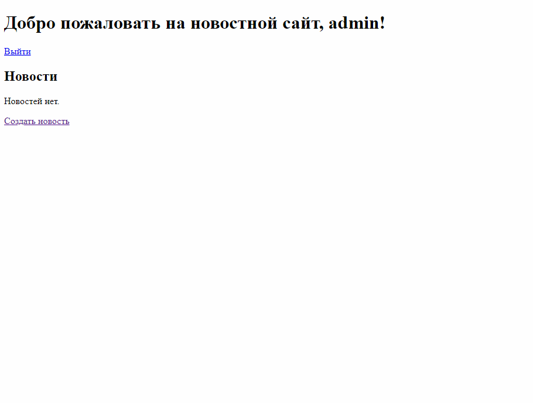

# News Django App

Python + Django + PostgreSQL

Реализовано:
* Возможность создания новости
* Возможность редактирования новости
* Просмотр всех новостей
* Разделение прав для тех кто может создавать и редактировать новости
* Удаление комментариев администрацией с добавлением соответствующей пометкой к комментарию

После аутентификации Пользователь может:
* Оставлять комментарии к любой новости
* Читать другие комментарии

Приложение развернуто на Heroku и доступно к просмотру по ссылке:

## [Ссылка](https://django-news-portal-project.herokuapp.com/news)

